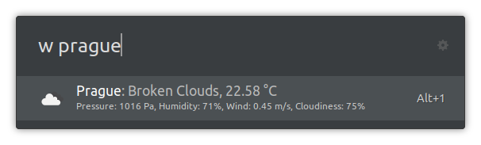

# Weather extension for Ulauncher using data from OpenWeatherMap.org

  

With this Ulauncher extension, you can quickly check the recent weather at given city.

## Installation

- Launch **Ulauncher**
- Click the ⚙️ icon next to the search field
- Click on the **Extensions** tab
- Click on ➕ **Add extension**
- Paste `https://github.com/fajtak/ulauncher-weather`
- Click **Add**

## Usage

First of all go to `OpenWeathermap.org/api`. Sign up and create your own API KEY. Copy the API key to the Ulaunchers' OpenWeatherMap extension. It may take a few hours (2-3) to get the key activated by the OpenWeatherMap so please be patient.

The extension can be used in two different ways:

* Predefined cities - Define your favourite cities in the Extension Settings page (separated by the semicolon). The weather in these cities is going to show up when no city is specified after the keyword and space. Only basic info for every city is shown.
* Interactive - Enter the city you are interested at after the keyword. You will get basic info about weather, expected precipitations in the next hour, and forecast for the next few days (to be added).

If you press Alt+X or enter on the chosen item, you will be redirected to the OpenWeatherMap.org forecast for the chosen city.

Try `w Prague`

I hope you will like this extension. If so, give me a star on github. Do you have any ideas/suggestions what to improve? Please, let me know.

Fajtak