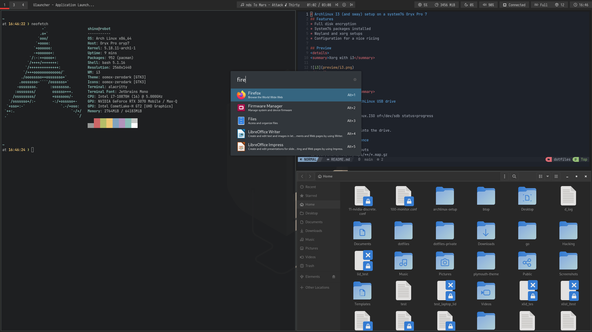

# Archlinux I3 (and sway) setup on a system76 Oryx Pro 7
## Features
* Full disk encryption
* System76 packages installed
* I3 and Sway setups
* Startup ArchLinux Logo and styled FDE password prompt
* SDDM Greeter
* Notifications 
* Built-In screen turns off when lid is closed

## Wayland: Known bugs
* Screensharing does not work
* Electron applications dont work
* Behaviour rather wonky with Nvidia driver and vulkan wlr renderer
* Screenshots dont work using NVIDIA driver

## Preview
<details>
<summary>SDDM Greeter</summary>


</details>

<details>
<summary>Xorg with i3</summary>


</details>
<details>
<summary>Wayland with sway</summary>


</details>

## Installation
<details>
<summary>System setup</summary>

### Create a bootable ArchLinux USB drive
```sh
sudo umount /dev/sdx
sudo dd bs=4M if=arch_linux.ISO of=/dev/sdb status=progress
```

Insert drive and reboot into the drive.

### Installation convinience
```sh
# Available keyboard layouts
ls /usr/share/kbd/keymaps/**/*.map.gz
loadkeys de-latin1

# Adjust TTY font size
ls /usr/share/kbd/consolefonts | grep -P "[2-9]\d+\.ps"
# Use the biggest font you can find
setfont latarcyrheb-sun32
```

### Verify boot mode
If it shows an output it uses UEFI, if not it uses BIOS
```sh
ls /sys/firmware/efi/efivars
```
This tutorial only supports UEFI.

### Setting up an internet connection
```sh
# Verify your connection
ping www.google.com

# If not try this
## Ethernet
### Find adapters
ip link
### Configure adapter
ip link set NIC up
dhclient NIC

## Wireless
ip link
ip link set wlan0 up
### Chose on variant
#### No encryption
iw dev wlan0 connect “your_essid”
#### WEP
iw dev wlan0 connect “your_essid” key 0:your_key
#### WPA/WPA2
wpa_passphrase my_essid my_passphrase > /etc/wpa_supplicant/my_essid.conf
wpa_supplicant -c /etc/wpa_supplicant/my_essid.conf -i wlan0
wpa_supplicant -B -c /etc/wpa_supplicant/my_essid.conf -i wlan0
dhclient wlan0

# Verify your connection
ping www.google.com
```

### Update system clock
```sh
timedatectl set-ntp true
```

### Prepare for LUKS encryption
```sh
modprobe dm-crypt
modprobe dm-mod
```

### Prepare disks
```sh
# Find your disk for me its nvme1n1
lsblk

# You may have to remove partitions before
# Follow the instructions d, enter, select partition, repeat
fdisk /dev/nvme1n1

# Choose gpt
cfdisk /dev/nvme1n1
# Create 3 partitions
## Goto new, enter size and select type, 'Free Space'
## First: Size: 256MB, Type: 'EFI'
## Second: Size: 512MB, Type: 'ext4'
## Third: Size: Rest, Type: 'ext4'
## Goto write and press enter
```

#### Encrypt root partition
```sh
# Confirm with uppercase YES and type desired password
cryptsetup luksFormat -v -s 512 -h sha512 /dev/nvme1n1p3

# Open it, it will prompt for your password
# The partition will be available under /dev/mapper/luks_root
cryptsetup open /dev/nvme1n1p3 luks_root
```

#### Format and mount file system
```sh
# Format all partitions
mkfs.vfat -n “EFI” /dev/nvme1n1p1
mkfs.ext4 -L boot /dev/nvme1n1p2
mkfs.ext4 -L root /dev/mapper/luks_root

# Mount them
mount /dev/mapper/luks_root /mnt
mkdir /mnt/boot
mount /dev/nvme1n1p2 /mnt/boot
mkdir /mnt/boot/efi
mount /dev/nvme1n1p1 /mnt/boot/efi

# Create a swap
cd /mnt
dd if=/dev/zero of=swap bs=1M count=1024
mkswap swap
swapon swap
chmod 0600 swap
```

### Update Pacman mirrors
Find the mirror closes to you and copy it to the top of the list
```sh
vim /etc/pacman.d/mirrorslist
```

### Installing ArchLinux
```sh
# Pacstrap
pacstrap -i /mnt base base-devel efibootmgr grub linux linux-firmare networkmanager sudo vi gvim bash-completion nano
genfstab -U /mnt >> /mnt/etc/fstab

# Change root to new system
arch-chroot /mnt

# Install packages that are used later
pacman -S netctl dialog dhcpcd pulseaudio alsa linux-headers ntfs-3g
pacman -S xf86-video-intel xf86-video-nouveau mesa mesa-demos acpi acpid

# Time zone
ln -sf /usr/share/zoneinfo/Europe/Berlin /etc/localtime
hwclock --systohc

# Localization
## Uncomment your required locals
vim /etc/locale.gen
locale-gen
echo LANG=en_US.UTF-8 > /etc/locale.conf
export LANG=en_US.UTF-8
export KEYMAP=de-latin1
echo KEYMAP=de-latin1 > /etc/vconsole.conf

# Network
echo robot > /etc/hostname
echo "127.0.0.1 localhost" >> /etc/hosts
echo "::1 localhost" >> /etc/hosts
echo "127.0.1.1 robot.localdomain robot" >> /etc/hosts

# Sudo
## Set up root password
passwd

## Add user
useradd -m -g wheel shino
passwd shino

## Uncomment wheel group
vim /etc/sudoers
```

### Bootloader
```sh
# Edit the grub configuration
vim /etc/default/grub
# Add the following below 'GRUB_CMDLINE_LINUX_DEFAULT'
# GRUB_CMDLINE_LINUX=”cryptdevice=/dev/nvme1n1p3:luks_root”

# Edit Initframs config
vim /etc/mkinitcpio.conf
# Your HOOKS should looks similar to this
# HOOKS=(base udev autodetect modconf block encrypt filesystems keyboard fsck)
mkinitcpio -p linux

# Install bootloader
grub-install --boot-directory=/boot --efi-directory=/boot/efi /dev/nvme1n1p2
grub-mkconfig -o /boot/grub/grub.cfg
grub-mkconfig -o /boot/efi/EFI/arch/grub.cfg
```

### Exit and reboot
```sh
exit
reboot
```
</details>

<details>
<summary>Configuration</summary>

### Configuration
#### Installing more essentials
```sh
dhcpcd
sudo pacman -S zip unzip tar unrar wget htop clang cmake git python go openssh npm pacman-contrib pkgconfig autoconf automake man p7zip bzip2 zstd xz gzip
```

#### Network
```sh
sudo systemctl enable --now NetworkManager
# You may need to use 'nmtui' to configure the network
sudo systemctl enable --now acpid
```

#### CPU microcode
```sh
sudo pacman -S intel-ucode
sudo grub-mkconfig -o /boot/grub/grub.cfg
```

#### App Armor
```sh
sudo pacman -S apparmor
sudo systemctl enable --now apparmor.service

# Edit the grub configuration
sudo vim /etc/default/grub
# GRUB_CMDLINE_LINUX=”apparmor=1 lsm=lockdown,yama,apparmor cryptdevice=/dev/nvme1n1p3:luks_root”
sudo grub-mkconfig -o /boot/grub/grub.cfg
```

#### UFW
```sh
sudo pacman -S ufw
sudo systemctl enable --now ufw
sudo ufw enable
```

#### YAY: Aur Repos
```sh
# Improve makepkg compile time
sudo sed -i 's/#MAKEFLAGS="-j2"/MAKEFLAGS="-j12"/g' /etc/makepkg.conf

# Installing yay
## Im not sure if yay is in the community repo or not, you should check it before proceeding
cd
git clone https://aur.archlinux.org/yay.git
cd yay
makepkg
## Very likely you have to adjust this version
sudo pacman -U yay-9.4.4-1-x86_64.pkg.tar.xz
cd ..
rm -rf yay
```

#### System76 proprietary drivers
```sh
yay -s system76-io-dkms system76-dkms system76-firmware-daemon firmware-manager-git system76-acpi-dkms system76-driver system76-power

# Fixes sha512 error during dkms
sudo ln -s /usr/bin/sha512sum /usr/bin/sha512

sudo systemctl enable --now system76-firmware-daemon
sudo systemctl enable --now system76
sudo systemctl enable --now com.system76.PowerDaemon.service
```

#### Graphics
The Oryx Pro 7 comes with an integrated and discrete graphics card. To make use of the dGPU and all displays we need to use PRIME.
```sh
sudo yay -S nvidia nvidia-utils nvidia-settings nvidia-prime optimus-manager

# PRIME
sudo cp dotfiles/optimus-manager.conf /etc/optimus-manager/
sudo systemctl enable optimus-manager

# mkinitcpio
# MODULES=(intel_agp i915)
sudo vim /etc/mkinitcpio.conf
sudo mkinitcpio -P

# grub config
# fbcon=map:1 forces luks output on the builtin display during boot when external monitors are connected
# However this also causes that if none are selected you are blind again to type luks, which is why we need to add another grub entry
# Add fbcon=map:1 rd.driver.blacklist=nouveau nvidia-drm.modeset=1 to GRUB_CMDLINE_LINUX_DEFAULT
sudo vim /etc/default/grub
sudo grub-mkconfig -o /boot/grub/grub.cfg

# Enable dGPU
reboot
prime-offload
optimus-manager --switch nvidia
system76-power graphics nvidia
reboot
```

#### Audio
```sh
pacman -S alsa alsa-firmware pulseaudio pavucontrol

# Create the following file
echo "options snd_hda_intel probe_mask=1" > /etc/modprobe.d/audio-patch.conf

# Reboot to apply it to the system
```

#### Java
```sh
sudo pacman -S jre-openjdk jdk-openjdk
sudo archlinux-java set java-17-openjdk
```

#### Anti-Virus
Required by all companies, here is one that doesnt annoy much
```sh
sudo pacman -S clamav
freshclam
sudo systemctl enable clamav-freshclam.service
sudo systemctl start clamav-freshclam.service
```

#### Printer
```sh
yay -S cups cups-pdf usbutils
sudo systemctl enable cups.socket
```
</details>

<details>
<summary>Actual rices</summary>

### Ricing
```bash
bash ./scripts/rice.sh

nvim +PackerInstall

# Edit mkinitcpio and add "plymouth plymouth-encrypt" in HOOKS auf "udev"
sudo mkinitcpio -p linux
sudo plymouth-set-default-theme pop-basic -R

# reboot for everything to take effect
```
</details>
