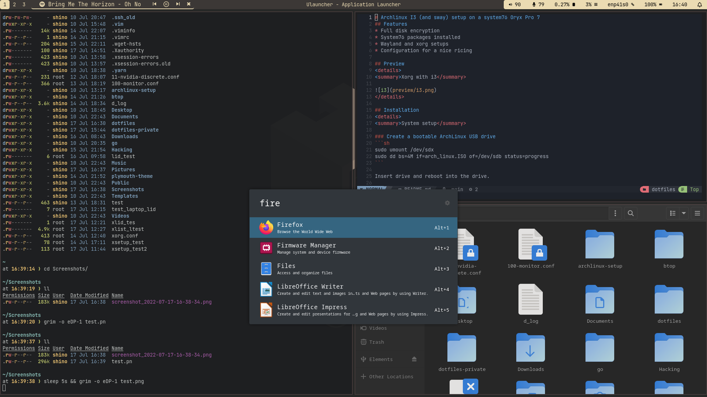

# Arch Linux i3 setup on a System76 Oryx Pro 7
## Features
* Full disk encryption
* System76 packages installed
* i3 and Sway setups
* Startup Arch Linux logo and styled FDE password prompt
* SDDM greeter
* Notifications 
* Built-In screen turns off when lid is closed

## Wayland: Known bugs
* Screensharing does not work
* Electron applications dont work
* Behaviour rather wonky with NVIDIA driver and vulkan wlr renderer
* Screenshots dont work using NVIDIA driver

## Preview
<details>
<summary>SDDM greeter</summary>


</details>

<details>
<summary>Xorg with i3</summary>


</details>
<details>
<summary>Wayland with sway</summary>


</details>

## Installation
<details>
<summary>System setup</summary>

### Create a bootable ArchLinux USB drive
```sh
sudo umount /dev/sdx
sudo dd bs=4M if=arch_linux.ISO of=/dev/sdb status=progress
```

Insert drive and reboot into the drive.

### Installation convinience
```sh
# Available keyboard layouts
ls /usr/share/kbd/keymaps/**/*.map.gz
loadkeys de-latin1

# Adjust TTY font size
ls /usr/share/kbd/consolefonts | grep -P "[2-9]\d+\.ps"
# Use the biggest font you can find
setfont latarcyrheb-sun32
```

### Verify boot mode
If it shows an output it uses UEFI, if not it uses BIOS
```sh
ls /sys/firmware/efi/efivars
```
This tutorial only supports UEFI.

### Setting up an internet connection
```sh
# Verify your connection
ping www.google.com

# If not try this
## Ethernet
### Find adapters
ip link
### Configure adapter
ip link set NIC up
dhclient NIC

## Wireless
ip link
ip link set wlan0 up
### Chose on variant
#### No encryption
iw dev wlan0 connect “your_essid”
#### WEP
iw dev wlan0 connect “your_essid” key 0:your_key
#### WPA/WPA2
wpa_passphrase my_essid my_passphrase > /etc/wpa_supplicant/my_essid.conf
wpa_supplicant -c /etc/wpa_supplicant/my_essid.conf -i wlan0
wpa_supplicant -B -c /etc/wpa_supplicant/my_essid.conf -i wlan0
dhclient wlan0

# Verify your connection
ping www.google.com
```

### Update system clock
```sh
timedatectl set-ntp true
```

### Prepare for LUKS encryption
```sh
modprobe dm-crypt
modprobe dm-mod
```

### Prepare disks
```sh
# Find your disk for me its nvme1n1
lsblk

# You may have to remove partitions before
# Follow the instructions d, enter, select partition, repeat
fdisk /dev/nvme0n1

# Choose gpt
cfdisk /dev/nvme0n1
# Create 3 partitions
## Goto new, enter size and select type, 'Free Space'
## First: Size: 256MB, Type: 'EFI'
## Second: Size: 512MB, Type: 'ext4'
## Third: Size: Rest, Type: 'ext4'
## Goto write and press enter
```

#### Encrypt root partition
```sh
# Confirm with uppercase YES and type desired password
cryptsetup luksFormat -v -s 512 -h sha512 /dev/nvme0n1p3

# Open it, it will prompt for your password
# The partition will be available under /dev/mapper/luks_root
cryptsetup open /dev/nvme0n1p3 luks_root
```

#### Format and mount file system
```sh
# Format all partitions
mkfs.vfat -n “EFI” /dev/nvme0n1p1
mkfs.ext4 -L boot /dev/nvme0n1p2
mkfs.ext4 -L root /dev/mapper/luks_root

# Mount them
mount /dev/mapper/luks_root /mnt
mkdir /mnt/boot
mount /dev/nvme0n1p2 /mnt/boot
mkdir /mnt/boot/efi
mount /dev/nvme0n1p1 /mnt/boot/efi

# Create a swap
cd /mnt
dd if=/dev/zero of=swap bs=1M count=65536
mkswap swap
swapon swap
chmod 0600 swap
```

### Update Pacman mirrors
Find the mirror closes to you and copy it to the top of the list
```sh
vim /etc/pacman.d/mirrorslist
```

### Installing ArchLinux
```bash
# Pacstrap
pacstrap -i /mnt base base-devel efibootmgr grub linux linux-firmare networkmanager sudo vi gvim bash-completion nano
genfstab -U /mnt >> /mnt/etc/fstab

# Change root to new system
arch-chroot /mnt

pacman -S git
git clone https://github.com/Geigerkind/dotfiles
cd dotfiles
bash ./scripts/install_arch.sh nvme0n1p2 nvme0n1p3

exit
reboot
```
</details>

<details>
<summary>Configuration</summary>

```bash
bash ./scripts/config.sh nvme0n1p3

# TODO: Find out what is actual default to replace it
# grub config
# fbcon=map:1 forces luks output on the builtin display during boot when external monitors are connected
# However this also causes that if none are selected you are blind again to type luks, which is why we need to add another grub entry
# Add fbcon=map:1 rd.driver.blacklist=nouveau nvidia-drm.modeset=1 to GRUB_CMDLINE_LINUX_DEFAULT
sudo vim /etc/default/grub
sudo grub-mkconfig -o /boot/grub/grub.cfg

# Enable dGPU
reboot
prime-offload
optimus-manager --switch nvidia
system76-power graphics nvidia

reboot
```
</details>

<details>
<summary>Ricing</summary>

```bash
bash ./scripts/rice.sh

nvim +PackerInstall

# Edit mkinitcpio and add "plymouth plymouth-encrypt" in HOOKS auf "udev"
sudo mkinitcpio -p linux
sudo plymouth-set-default-theme pop-basic -R

# reboot for everything to take effect
```
</details>
